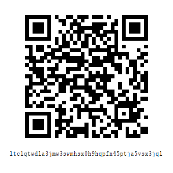

# TkDecentralizedWhisper

[](https://github.com/thiliapr/tkfreechat/blob/master/LICENSE)
[](https://github.com/thiliapr/TkDecentralizedWhisper/stargazers)

Languages: [English](./README.md) | [简体中文 中国大陆](repo/README.zh-cn.md)

TkDecentralizedWhisper is a free and open-source software project licensed under **AGPLv3 or higher**.

## Features
- [ ] Main functionalities
    - [ ] Detect TkDecentralizedWhisper servers
    - [ ] Distribute resources
    - [ ] Resource handling mechanism (garbage collection)
        - [ ] Heat rating

All core functionalities are currently under development.

## Installation
1. Clone the repository:
    ```shell
    git clone https://github.com/thiliapr/TkDecentralizedWhisper.git
    cd TkDecentralizedWhisper/
    ```
2. Install dependencies
    ```shell
    py -3 -m pip install -r requirements.txt
    ```

## Usage
Run the following command:
```shell
py -3 tkdw.py
```

## Contribute to the project
Feel free to explore the project further and contribute to its development! 

## Donations
### Litecoin
[](litecoin:LTC1QTWDLA3JMW3SWMHSX0H9HQPFN45PTJA5VSX3JQL?label=Support%20thiliapr)

If you'd like to support this project, consider donating to the Litecoin wallet with the following address: `ltc1qtwdla3jmw3swmhsx0h9hqpfn45ptja5vsx3jql`
